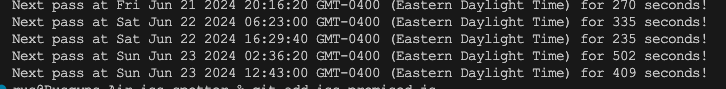

# ISS Spotter

## Description
A little app for space enthusiasts who are interested in spotting the International Space Station (ISS). The ISS completes multiple revolutions around Earth per day. In fact, it passes overhead every ~90 minutes, and in some cases can even be spotted with the naked eye, though not every time.

Fetch your public ip address Determine your geo coordinates as per obtained public ip address Determined the ISS fly over time Determined the next ISS fly over time

## Dependencies
1. npm
2. needle

## Executing the Program
1. Clone the repository [iss_spotter](https://github.com/Rusgyn/iss_spotter) to your local machine. See [github cloning a repository steps](https://docs.github.com/en/repositories/creating-and-managing-repositories/cloning-a-repository) for reference.
2. Install dependencies via npm
  ```
  npm init -y
  ```

  ```
  npm install needle
  ```

3. On the [command line](https://developer.mozilla.org/en-US/docs/Learn/Tools_and_testing/Understanding_client-side_tools/Command_line), navigate to the root directory of iss_spotter.
  ```
  cd /path/to/where/you/save/iss_spotter
  ```

4. Run the command request.
  ```
  node index2.js
  ```

## Image
Sample output


